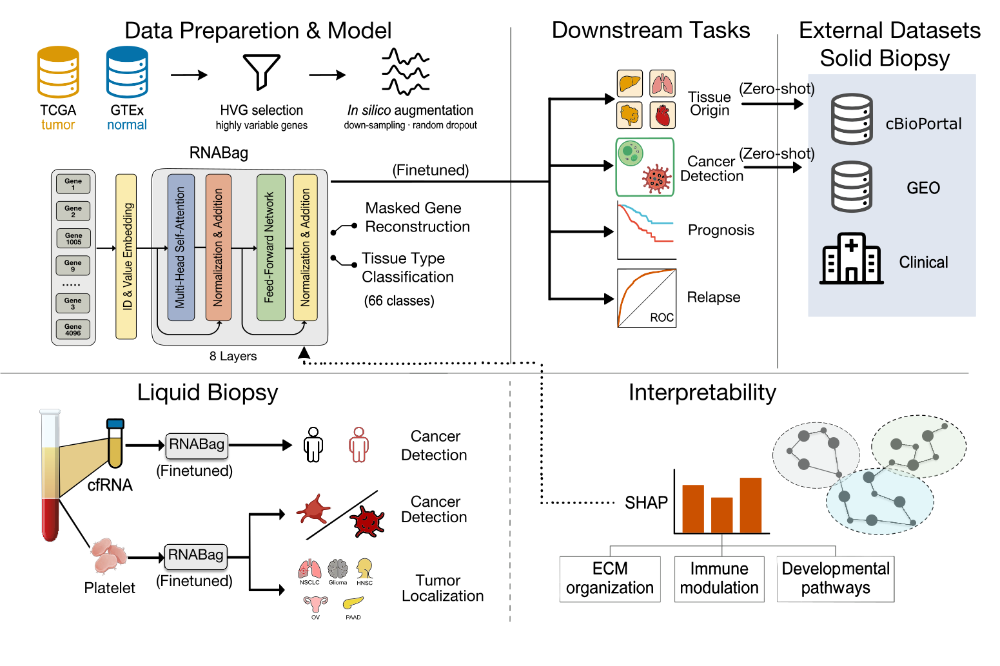

# RNAbag

## Overview



[RNABag: A Generalizable Transcriptome Foundation Model for Precision Oncology across Biopsy Modalities](https://www.biorxiv.org/content/10.64898/2026.04.19.719450v1)
It supports the following tasks:

- **Tissue Cancer Detection**  
- **Tissue Origin Identification**  
- **Plasma Cancer Detection**
- **Platelet Cancer Detection**  
- **Platelet Tumor Localization**  

[](https://deepwiki.com/DTD007/RNABag)
## Project Structure

The project is organized into two primary modules:

```
Inference_code/
├── data/                  # Data processing module
│   ├── process_data.py    # Main processing script
│   └── README.md          # Data processing documentation
└── infer_code/            # Inference module
    ├── main.py            # Unified entry point for inference
    ├── checkpoints/       # Model weights (.ckpt)
    ├── config/            # Model configurations
    ├── data/              # Dataset and DataModule definitions
    ├── inference/         # Core inference logic
    ├── models/            # Transformer architecture
    ├── utils/             # Helper utilities
    └── README.md          # Inference documentation
```

---

## Workflow Overview

The overall workflow consists of two main steps:

### 1. Data Processing
Before running inference, raw RNA-seq data (FPKM) must be processed and transformed. The `data/process_data.py` script handles mapping, filtering, and normalization.

**Key inputs required:**
- `fpkm.tsv`: Raw expression data.
- `mapping/Human_GRCh38.p13_annot.tsv`: Default annotation mapping GeneID to Symbol.
- `tcga_hvg_gene_4096.txt`: List of 4096 High Variability Genes.

**Command to run processing:**
```bash
python data/process_data.py \
    --fpkm path/to/fpkm.tsv \
    --out output_dir
```
*The output will include `log1p_data.npy`. For duplicate GeneID/Symbol rows,
input order is preserved and only the first occurrence is retained. Current
Symbols take priority, with a conservative unique historical-Synonym fallback;
see `data/README.md` for the preprocessing contract and future golden-data
review note.*

### 2. Downsteam Tasks
Once the data is processed, you can use the `infer_code` module to predict cancer presence or tissue origin.

**Setup:**
1. The legacy `infer_code/requirements.txt` is a Conda environment export,
   despite its filename. Create it with
   `conda env create -f infer_code/requirements.txt`, not `pip install -r`.
2. Ensure checkpoints (e.g., `Tissue_cancer_detect.ckpt`) are in `infer_code/checkpoints/`.

**Command to run:**
```bash
# For Downsteam Tasks
python infer_code/main.py --task <task_name> --device cuda

task_name :
    - tissue_cancer_detect
    - tissue_origin
    - plasma_cancer_detect
    - platelet_cancer_detect
    - platelet_tumor_local

```
Set `indir` in `infer_code/config/config.py` to the directory containing
`log1p_data.npy` before running inference.

---

email: Pengchao Luo[lingshumaa@gmail.com]

## License

This project is licensed under the MIT License.
